# gestion-productos

Práctica guiada: **Persistencia y relaciones con Spring Data JPA**.
Servicios Web, Unidad II: Desarrollo de Servicios Web con Spring Boot (UAM).

API REST desarrollada con Spring Boot que se conecta a PostgreSQL usando Spring Data JPA e Hibernate. Las entidades están relacionadas, se acceden con repositorios y el esquema de la base de datos se gestiona con migraciones de Flyway.

## Tecnologías

| Elemento | Valor |
|---|---|
| Proyecto | Maven |
| Lenguaje | Java 21 |
| Framework | Spring Boot 4.1.1 |
| Group / Artifact | `ni.edu.uam` / `gestion-productos` |
| Dependencias | Spring Web, Spring Data JPA, PostgreSQL Driver, Validation, Flyway Migration |
| Base de datos | PostgreSQL 17 (`gestion_productos`) |

## Configuración de la conexión

Primero se crea la base de datos vacía (las tablas las crea Flyway):

```sql
CREATE DATABASE gestion_productos;
```

`src/main/resources/application.properties`:

```properties
spring.application.name=gestion-productos

spring.datasource.url=jdbc:postgresql://localhost:5432/gestion_productos
spring.datasource.username=postgres
spring.datasource.password=postgres

spring.jpa.hibernate.ddl-auto=validate
spring.jpa.show-sql=true
spring.jpa.properties.hibernate.format_sql=true

spring.flyway.enabled=true
```

**¿Qué función cumple `spring.jpa.hibernate.ddl-auto=validate`?**
Hibernate no crea ni modifica tablas. Al iniciar, solo comprueba que las entidades coincidan con las tablas y columnas que existen en la base de datos. Si falta una tabla o una columna mapeada, la aplicación no arranca. Así Flyway es el único responsable de la estructura de la base, y Hibernate solo verifica que el código esté alineado con ella.

## Ejecución

```bash
./mvnw spring-boot:run      # Linux / macOS
mvnw.cmd spring-boot:run    # Windows
```

La API queda disponible en `http://localhost:8080`.

## Estructura de paquetes

```
src/main/java/ni/edu/uam/gestion_productos
├── GestionProductosApplication.java
├── controller
│   ├── CategoriaController.java
│   ├── ProductoController.java
│   └── ProveedorController.java
├── entity
│   ├── Categoria.java
│   ├── Producto.java
│   └── Proveedor.java
└── repository
    ├── CategoriaRepository.java
    ├── ProductoRepository.java
    └── ProveedorRepository.java

src/main/resources
├── application.properties
└── db/migration
    ├── V1__crear_tablas.sql
    ├── V2__agregar_descripcion_producto.sql
    └── V3__crear_proveedor.sql
```

## Entidades desarrolladas

| Entidad | Tabla | Atributos | Relación |
|---|---|---|---|
| `Categoria` | `categoria` | id, nombre, activa | Una categoría tiene muchos productos |
| `Producto` | `producto` | id, codigo, nombre, precioVenta, existencia | `@ManyToOne` a `Categoria` (`categoria_id`) y a `Proveedor` (`proveedor_id`) |
| `Proveedor` | `proveedor` | id, nombre, telefono, correo, activo | Un proveedor tiene muchos productos |

**¿Qué relación representa `@ManyToOne`?**
Una relación muchos a uno: muchos productos pertenecen a una misma categoría (y a un mismo proveedor). En la tabla `producto` se guarda como una llave foránea (`categoria_id`, `proveedor_id`) que apunta al registro relacionado.

## Diagrama de relaciones

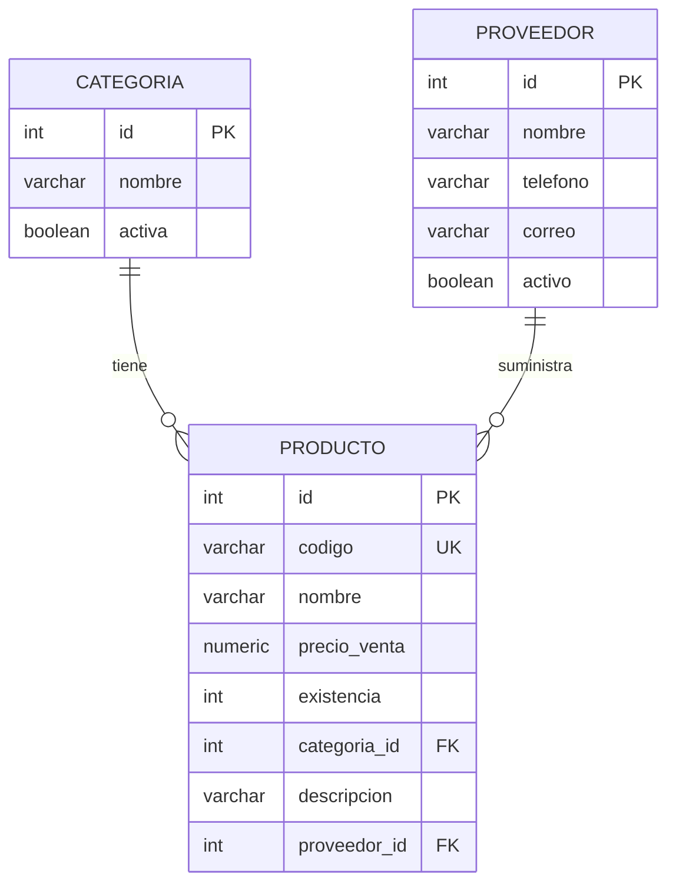

- **Categoria 1 ── N Producto**
- **Proveedor 1 ── N Producto**

## Scripts de migración

### V1__crear_tablas.sql

```sql
CREATE TABLE categoria (
    id SERIAL PRIMARY KEY,
    nombre VARCHAR(100) NOT NULL,
    activa BOOLEAN NOT NULL DEFAULT TRUE
);

CREATE TABLE producto (
    id SERIAL PRIMARY KEY,
    codigo VARCHAR(30) NOT NULL UNIQUE,
    nombre VARCHAR(150) NOT NULL,
    precio_venta NUMERIC(12,2) NOT NULL,
    existencia INTEGER NOT NULL DEFAULT 0,
    categoria_id INTEGER NOT NULL,

    CONSTRAINT fk_producto_categoria
        FOREIGN KEY (categoria_id)
        REFERENCES categoria(id)
);
```

### V2__agregar_descripcion_producto.sql

```sql
ALTER TABLE producto
ADD COLUMN descripcion VARCHAR(500);
```

### V3__crear_proveedor.sql (reto final)

```sql
CREATE TABLE proveedor (
    id SERIAL PRIMARY KEY,
    nombre VARCHAR(150) NOT NULL,
    telefono VARCHAR(20),
    correo VARCHAR(150),
    activo BOOLEAN NOT NULL DEFAULT TRUE
);

ALTER TABLE producto
ADD COLUMN proveedor_id INTEGER;

ALTER TABLE producto
ADD CONSTRAINT fk_producto_proveedor
    FOREIGN KEY (proveedor_id)
    REFERENCES proveedor(id);
```

`proveedor_id` permite nulos porque, cuando se aplicó V3, ya podían existir productos registrados sin proveedor.

## Endpoints y pruebas en Postman

| Método | URL | Descripción |
|---|---|---|
| GET | `/api/categorias` | Lista las categorías (al inicio devuelve `[]`) |
| POST | `/api/categorias` | Crea una categoría |
| GET | `/api/productos` | Lista los productos con su categoría y proveedor |
| POST | `/api/productos` | Crea un producto relacionado |
| GET | `/api/proveedores` | Lista los proveedores |
| POST | `/api/proveedores` | Crea un proveedor |

Para los POST se usa **Body → raw → JSON**.

**Categorías** (Computadoras, Accesorios, Monitores):

```json
{ "nombre": "Computadoras", "activa": true }
```

**Producto relacionado con una categoría:**

```json
{
    "codigo": "LAP-001",
    "nombre": "Laptop Lenovo",
    "categoria": { "id": 1 },
    "precioVenta": 850.00,
    "existencia": 10
}
```

**Proveedores (reto final):**

```json
{ "nombre": "Distribuidora Tecnologica S.A.", "telefono": "2222-3333", "correo": "ventas@distritec.com.ni", "activo": true }
{ "nombre": "Importadora de Computo Nica", "telefono": "2255-8899", "correo": "contacto@icnica.com.ni", "activo": true }
```

**Productos asociados a un proveedor:**

```json
{
    "codigo": "MOU-001",
    "nombre": "Mouse Logitech",
    "categoria": { "id": 2 },
    "proveedor": { "id": 1 },
    "precioVenta": 25.00,
    "existencia": 50
}
```

```json
{
    "codigo": "MON-001",
    "nombre": "Monitor Samsung 24 pulgadas",
    "categoria": { "id": 3 },
    "proveedor": { "id": 2 },
    "precioVenta": 180.00,
    "existencia": 15
}
```

**Cómo se representa la categoría dentro del producto.** En `GET /api/productos` cada producto incluye la categoría como un objeto JSON completo (id, nombre y activa), y lo mismo pasa con el proveedor. En la base de datos solo se guarda la llave foránea; Hibernate carga el objeto relacionado y Jackson lo convierte a JSON. En la respuesta del POST la categoría solo trae el `id` enviado (con `nombre` en `null`), porque ese objeto todavía no se ha leído de la base. Al consultar con GET ya aparece completa.

## Evidencia en PostgreSQL

Al iniciar la aplicación, Flyway registra las migraciones en la tabla `flyway_schema_history`:

```sql
SELECT installed_rank, version, description, success
FROM flyway_schema_history;
```

| installed_rank | version | description | success |
|---|---|---|---|
| 1 | 1 | crear tablas | true |
| 2 | 2 | agregar descripcion producto | true |
| 3 | 3 | crear proveedor | true |

Consulta para verificar las relaciones:

```sql
SELECT p.codigo, p.nombre, c.nombre AS categoria, pr.nombre AS proveedor
FROM producto p
JOIN categoria c ON c.id = p.categoria_id
LEFT JOIN proveedor pr ON pr.id = p.proveedor_id;
```

## Capturas de evidencia

Capturas tomadas con la aplicación en ejecución. Todas están en la carpeta [`evidencias/`](evidencias).

### Configuración y estructura del proyecto

**Estructura de paquetes** (`controller`, `entity`, `repository`):

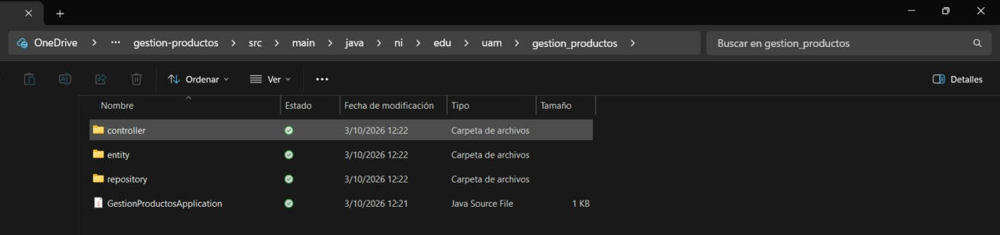

**Scripts de migración V1, V2 y V3** en `src/main/resources/db/migration`:

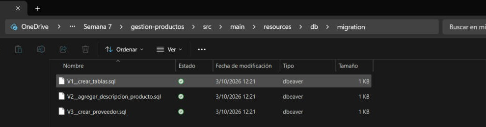

**Arranque de la aplicación:** conexión a `jdbc:postgresql://localhost:5432/gestion_productos`, Flyway valida las 3 migraciones (el esquema ya está en la versión 3) y Hibernate se configura con `PostgreSQLDialect`:

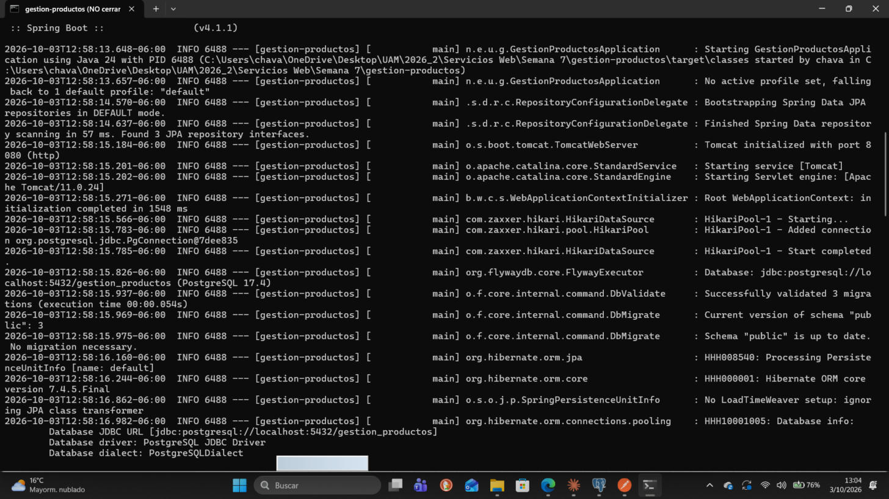

### Evidencia de PostgreSQL (pgAdmin)

**Paso 2. Creación de la base de datos** `gestion_productos`:

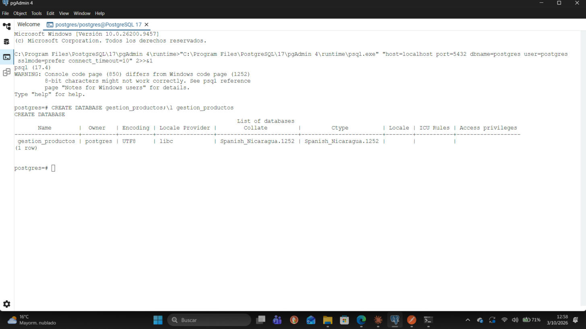

**Historial de Flyway** (`flyway_schema_history`) con V1, V2 y V3 aplicadas correctamente:

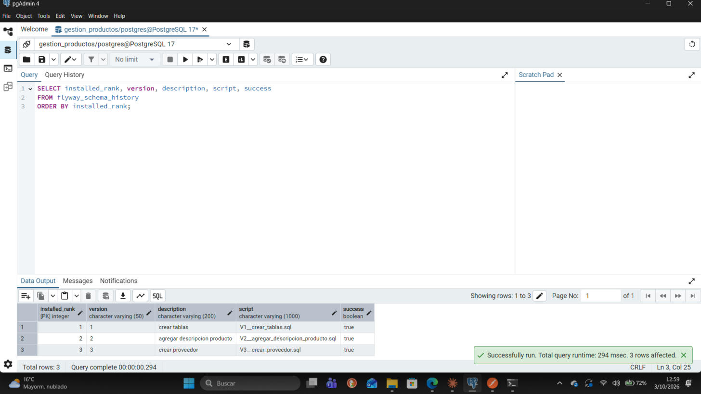

**Diagrama de relaciones (ERD generado por pgAdmin):** `categoria 1 ── N producto` y `proveedor 1 ── N producto`:

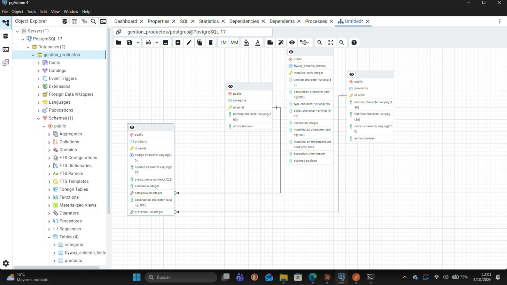

**Productos con su categoría y su proveedor** (consulta con `JOIN`):

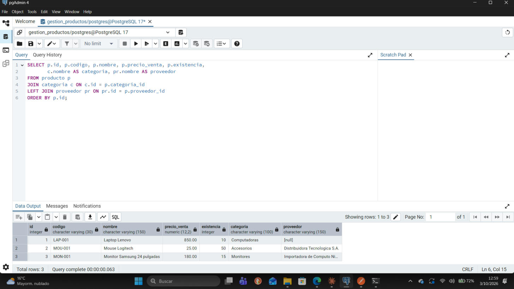

### Pruebas en Postman

**Paso 9. POST /api/categorias** (Computadoras):

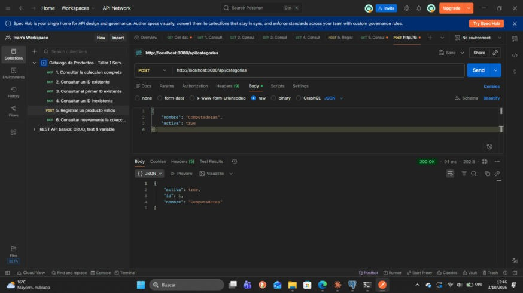

**POST /api/categorias** (Accesorios y Monitores):

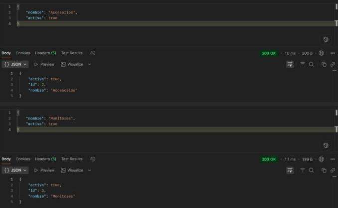

**Paso 8. GET /api/categorias** con las tres categorías creadas:

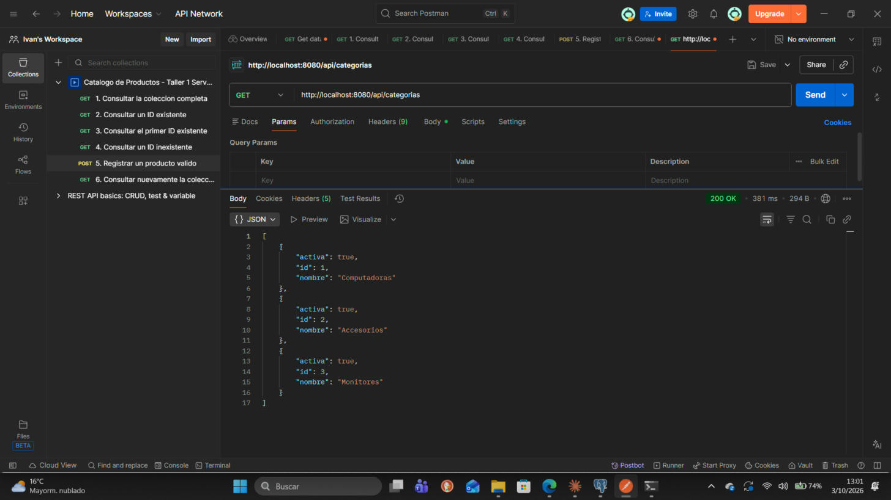

**Paso 11. POST /api/productos** (LAP-001 relacionado con la categoría 1):

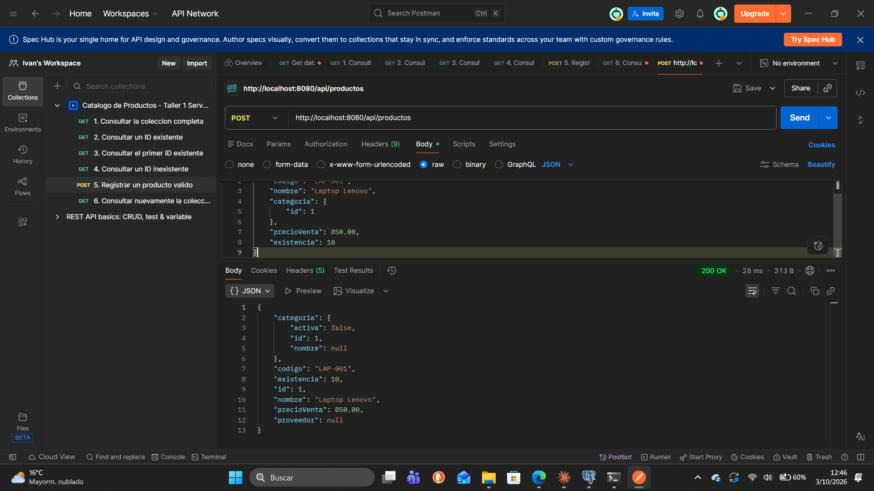

**Reto final. POST /api/proveedores** (dos proveedores):

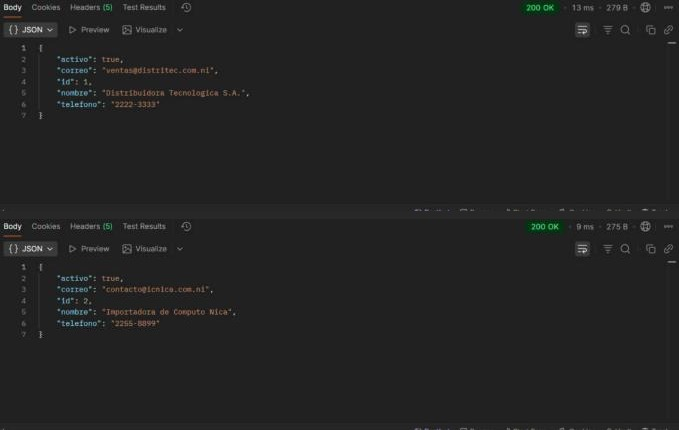

**Reto final. GET /api/proveedores:**

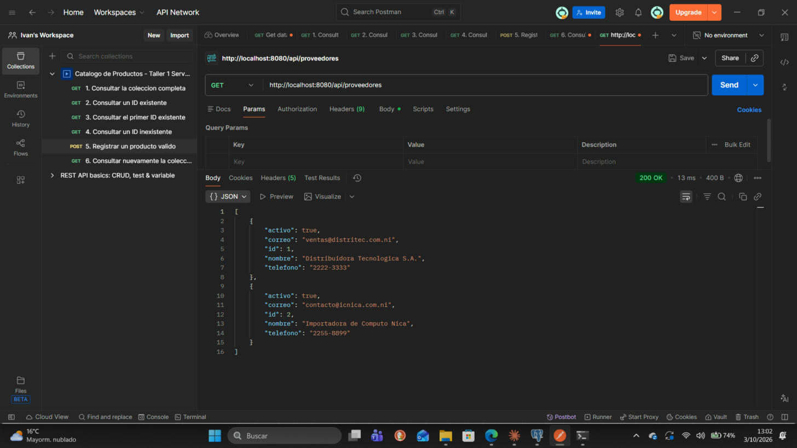

**Reto final. POST /api/productos** con proveedor asociado (MOU-001 y MON-001):

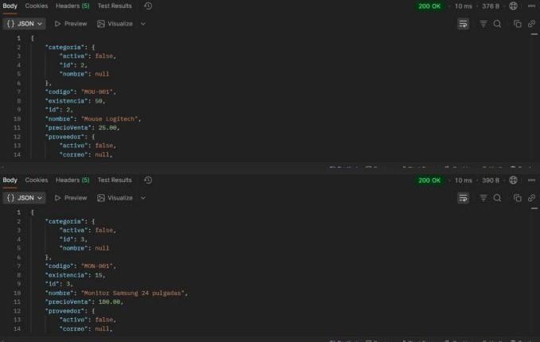

**Pasos 10 y 11. GET /api/productos:** cada producto muestra su categoría y su proveedor como objetos anidados:

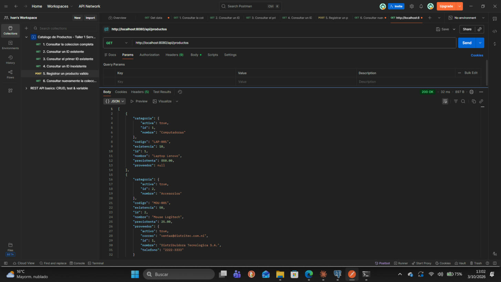

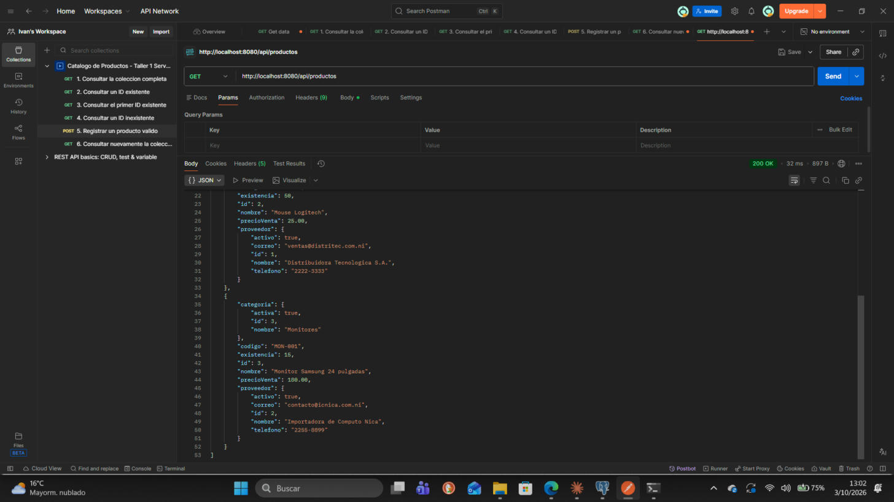

## Comprobación de aprendizaje

**1. ¿Cuál es la función de Spring Data JPA?**
Simplifica la capa de acceso a datos. A partir de interfaces de repositorio genera automáticamente la implementación de las operaciones CRUD, la paginación y las consultas derivadas del nombre de los métodos, sin escribir SQL ni código repetitivo. Por debajo usa JPA, con Hibernate como implementación.

**2. ¿Qué función cumple Hibernate?**
Es el ORM (*Object-Relational Mapping*) que implementa JPA. Traduce los objetos Java (entidades) a filas de tablas y viceversa, genera el SQL correspondiente, administra las conexiones y transacciones a través del `EntityManager` y resuelve las relaciones entre entidades.

**3. ¿Qué diferencia existe entre JPA y Hibernate?**
JPA (Jakarta Persistence API) es una **especificación**: define anotaciones (`@Entity`, `@Id`, `@ManyToOne`…) e interfaces, pero no tiene código que las ejecute. Hibernate es una **implementación** concreta de esa especificación, que además añade funciones propias. El código se escribe contra JPA, y Hibernate es el motor que lo hace funcionar.

**4. ¿Qué función cumple `@Entity`?**
Marca una clase como entidad persistente, es decir, una clase que se mapea a una tabla de la base de datos. Cada instancia corresponde a una fila. Se combina con `@Table` para indicar el nombre de la tabla y con `@Id` para la llave primaria.

**5. ¿Qué función cumple `@ManyToOne`?**
Define una relación muchos a uno entre dos entidades: muchos `Producto` se asocian a una sola `Categoria` (o a un solo `Proveedor`). En la base de datos se traduce en una llave foránea en la tabla del lado "muchos".

**6. ¿Qué función cumple `@JoinColumn`?**
Indica qué columna de la tabla actúa como llave foránea en la relación. En `@JoinColumn(name = "categoria_id")` se le dice a Hibernate que la relación con `Categoria` se guarda en la columna `categoria_id` de la tabla `producto`.

**7. ¿Qué función cumple `JpaRepository`?**
Es la interfaz de Spring Data JPA que, al extenderla (`JpaRepository<Entidad, TipoId>`), da sin implementar nada los métodos `findAll()`, `findById()`, `save()`, `deleteById()`, `existsById()`, `count()`, además de paginación y ordenamiento. Spring crea la implementación en tiempo de ejecución y la inyecta en los controladores.

**8. ¿Por qué se utilizan migraciones?**
Para versionar la estructura de la base de datos igual que se versiona el código. Cada cambio queda en un script ordenado que se aplica una sola vez y de forma automática, y Flyway lleva el control en `flyway_schema_history`. Así todos los entornos (desarrollo, pruebas, producción) tienen el mismo esquema, los cambios son reproducibles y queda un historial de qué se cambió y cuándo, sin depender de que Hibernate genere las tablas.

**9. ¿Qué diferencia existe entre V1, V2 y V3?**
Son versiones sucesivas del esquema que Flyway aplica en orden:
- **V1** crea la estructura inicial: tablas `categoria` y `producto`, con su llave foránea.
- **V2** modifica una tabla existente: agrega la columna `descripcion` a `producto`.
- **V3** agrega la tabla `proveedor` y la columna `proveedor_id` con su llave foránea en `producto`, para la relación Proveedor 1:N Producto.

Una migración ya aplicada no se edita: cada cambio nuevo va en una versión nueva.

**10. ¿Qué problema puede producir una relación bidireccional al generar JSON?**
Una **recursión infinita**. Si `Categoria` tiene una `List<Producto>` y cada `Producto` tiene su `Categoria`, al serializar Jackson va de la categoría a sus productos, de cada producto otra vez a la categoría, y así sucesivamente. Eso termina en un `StackOverflowError` o en un JSON infinito. Se evita con `@JsonIgnore`, con `@JsonManagedReference`/`@JsonBackReference`, o devolviendo DTOs en lugar de entidades. En este proyecto las relaciones son unidireccionales (solo `Producto` conoce a `Categoria` y a `Proveedor`), por lo que el problema no ocurre.

## Conclusión

Con esta práctica se construyó una API REST con Spring Boot conectada a PostgreSQL, en la que Spring Data JPA e Hibernate se encargan de la persistencia sin escribir SQL para las operaciones básicas. Las entidades `Categoria`, `Producto` y `Proveedor` se relacionaron con `@ManyToOne` y `@JoinColumn`, y se comprobó en Postman cómo esas relaciones se reflejan como objetos anidados en el JSON. Usar Flyway con `ddl-auto=validate` dejó claro el reparto de responsabilidades: las migraciones V1, V2 y V3 definen y versionan el esquema, y Hibernate solo valida que el código coincida con él. Los repositorios basados en `JpaRepository` redujeron mucho el código necesario para el CRUD. El reto final de Proveedor mostró cómo extender un modelo existente con una nueva migración sin afectar los datos ya registrados.
