# gestion-productos

Servicios Web, Unidad II: Desarrollo de Servicios Web con Spring Boot (UAM).

Este repositorio contiene dos prácticas sobre el mismo proyecto:

1. **Práctica guiada #1: Persistencia y relaciones con Spring Data JPA**: conexión a PostgreSQL, entidades, repositorios, relaciones y migraciones con Flyway (V1 a V3). Es la primera parte de este README.
2. **Práctica guiada #2: Laboratorio #1, Implementación de persistencia con Spring Data JPA, modelos, migraciones y relaciones**: capa de servicios, DTOs, CRUD completo, consultas por relación, relación Uno a Muchos bidireccional y relación Muchos a Muchos (V4). Ver [Laboratorio #1](#laboratorio-1-servicios-dtos-crud-y-relaciones).

API REST desarrollada con Spring Boot que se conecta a PostgreSQL usando Spring Data JPA e Hibernate. Las entidades están relacionadas, se acceden con repositorios y el esquema de la base de datos se gestiona con migraciones de Flyway.

## Tecnologías

| Elemento | Valor |
|---|---|
| Proyecto | Maven |
| Lenguaje | Java 21 |
| Framework | Spring Boot 4.1.1 |
| Group / Artifact | `ni.edu.uam` / `gestion-productos` |
| Dependencias | Spring Web, Spring Data JPA, PostgreSQL Driver, Validation, Flyway Migration |
| Base de datos | PostgreSQL 17 (`gestion_productos`) |

## Configuración de la conexión

Primero se crea la base de datos vacía (las tablas las crea Flyway):

```sql
CREATE DATABASE gestion_productos;
```

`src/main/resources/application.properties`:

```properties
spring.application.name=gestion-productos

spring.datasource.url=jdbc:postgresql://localhost:5432/gestion_productos
spring.datasource.username=postgres
spring.datasource.password=postgres

spring.jpa.hibernate.ddl-auto=validate
spring.jpa.show-sql=true
spring.jpa.properties.hibernate.format_sql=true

spring.flyway.enabled=true
```

**¿Qué función cumple `spring.jpa.hibernate.ddl-auto=validate`?**
Hibernate no crea ni modifica tablas. Al iniciar, solo comprueba que las entidades coincidan con las tablas y columnas que existen en la base de datos. Si falta una tabla o una columna mapeada, la aplicación no arranca. Así Flyway es el único responsable de la estructura de la base, y Hibernate solo verifica que el código esté alineado con ella.

## Ejecución

```bash
./mvnw spring-boot:run      # Linux / macOS
mvnw.cmd spring-boot:run    # Windows
```

La API queda disponible en `http://localhost:8080`.

## Estructura de paquetes

```
src/main/java/ni/edu/uam/gestion_productos
├── GestionProductosApplication.java
├── controller
│   ├── CategoriaController.java
│   ├── ProductoController.java
│   └── ProveedorController.java
├── entity
│   ├── Categoria.java
│   ├── Producto.java
│   └── Proveedor.java
└── repository
    ├── CategoriaRepository.java
    ├── ProductoRepository.java
    └── ProveedorRepository.java

src/main/resources
├── application.properties
└── db/migration
    ├── V1__crear_tablas.sql
    ├── V2__agregar_descripcion_producto.sql
    └── V3__crear_proveedor.sql
```

## Entidades desarrolladas

| Entidad | Tabla | Atributos | Relación |
|---|---|---|---|
| `Categoria` | `categoria` | id, nombre, activa | Una categoría tiene muchos productos |
| `Producto` | `producto` | id, codigo, nombre, precioVenta, existencia | `@ManyToOne` a `Categoria` (`categoria_id`) y a `Proveedor` (`proveedor_id`) |
| `Proveedor` | `proveedor` | id, nombre, telefono, correo, activo | Un proveedor tiene muchos productos |

**¿Qué relación representa `@ManyToOne`?**
Una relación muchos a uno: muchos productos pertenecen a una misma categoría (y a un mismo proveedor). En la tabla `producto` se guarda como una llave foránea (`categoria_id`, `proveedor_id`) que apunta al registro relacionado.

## Diagrama de relaciones

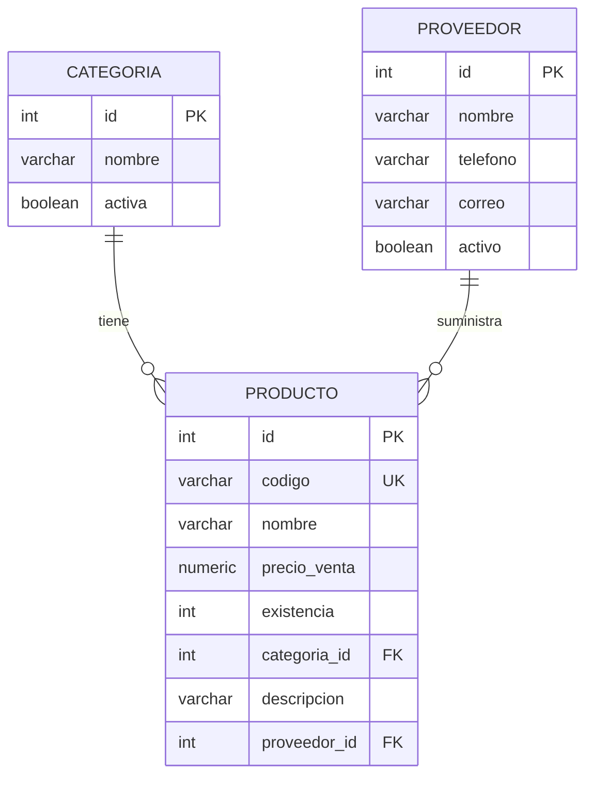
```mermaid
erDiagram
    CATEGORIA ||--o{ PRODUCTO : "tiene"
    PROVEEDOR ||--o{ PRODUCTO : "suministra"

    CATEGORIA {
        int id PK
        varchar nombre
        boolean activa
    }
    PRODUCTO {
        int id PK
        varchar codigo UK
        varchar nombre
        numeric precio_venta
        int existencia
        int categoria_id FK
        varchar descripcion
        int proveedor_id FK
    }
    PROVEEDOR {
        int id PK
        varchar nombre
        varchar telefono
        varchar correo
        boolean activo
    }
```

- **Categoria 1 ── N Producto**
- **Proveedor 1 ── N Producto**

## Scripts de migración

### V1__crear_tablas.sql

```sql
CREATE TABLE categoria (
    id SERIAL PRIMARY KEY,
    nombre VARCHAR(100) NOT NULL,
    activa BOOLEAN NOT NULL DEFAULT TRUE
);

CREATE TABLE producto (
    id SERIAL PRIMARY KEY,
    codigo VARCHAR(30) NOT NULL UNIQUE,
    nombre VARCHAR(150) NOT NULL,
    precio_venta NUMERIC(12,2) NOT NULL,
    existencia INTEGER NOT NULL DEFAULT 0,
    categoria_id INTEGER NOT NULL,

    CONSTRAINT fk_producto_categoria
        FOREIGN KEY (categoria_id)
        REFERENCES categoria(id)
);
```

### V2__agregar_descripcion_producto.sql

```sql
ALTER TABLE producto
ADD COLUMN descripcion VARCHAR(500);
```

### V3__crear_proveedor.sql (reto final)

```sql
CREATE TABLE proveedor (
    id SERIAL PRIMARY KEY,
    nombre VARCHAR(150) NOT NULL,
    telefono VARCHAR(20),
    correo VARCHAR(150),
    activo BOOLEAN NOT NULL DEFAULT TRUE
);

ALTER TABLE producto
ADD COLUMN proveedor_id INTEGER;

ALTER TABLE producto
ADD CONSTRAINT fk_producto_proveedor
    FOREIGN KEY (proveedor_id)
    REFERENCES proveedor(id);
```

`proveedor_id` permite nulos porque, cuando se aplicó V3, ya podían existir productos registrados sin proveedor.

## Endpoints y pruebas en Postman

| Método | URL | Descripción |
|---|---|---|
| GET | `/api/categorias` | Lista las categorías (al inicio devuelve `[]`) |
| POST | `/api/categorias` | Crea una categoría |
| GET | `/api/productos` | Lista los productos con su categoría y proveedor |
| POST | `/api/productos` | Crea un producto relacionado |
| GET | `/api/proveedores` | Lista los proveedores |
| POST | `/api/proveedores` | Crea un proveedor |

Para los POST se usa **Body → raw → JSON**.

**Categorías** (Computadoras, Accesorios, Monitores):

```json
{ "nombre": "Computadoras", "activa": true }
```

**Producto relacionado con una categoría:**

```json
{
    "codigo": "LAP-001",
    "nombre": "Laptop Lenovo",
    "categoria": { "id": 1 },
    "precioVenta": 850.00,
    "existencia": 10
}
```

**Proveedores (reto final):**

```json
{ "nombre": "Distribuidora Tecnologica S.A.", "telefono": "2222-3333", "correo": "ventas@distritec.com.ni", "activo": true }
{ "nombre": "Importadora de Computo Nica", "telefono": "2255-8899", "correo": "contacto@icnica.com.ni", "activo": true }
```

**Productos asociados a un proveedor:**

```json
{
    "codigo": "MOU-001",
    "nombre": "Mouse Logitech",
    "categoria": { "id": 2 },
    "proveedor": { "id": 1 },
    "precioVenta": 25.00,
    "existencia": 50
}
```

```json
{
    "codigo": "MON-001",
    "nombre": "Monitor Samsung 24 pulgadas",
    "categoria": { "id": 3 },
    "proveedor": { "id": 2 },
    "precioVenta": 180.00,
    "existencia": 15
}
```

**Cómo se representa la categoría dentro del producto.** En `GET /api/productos` cada producto incluye la categoría como un objeto JSON completo (id, nombre y activa), y lo mismo pasa con el proveedor. En la base de datos solo se guarda la llave foránea; Hibernate carga el objeto relacionado y Jackson lo convierte a JSON. En la respuesta del POST la categoría solo trae el `id` enviado (con `nombre` en `null`), porque ese objeto todavía no se ha leído de la base. Al consultar con GET ya aparece completa.

## Evidencia en PostgreSQL

Al iniciar la aplicación, Flyway registra las migraciones en la tabla `flyway_schema_history`:

```sql
SELECT installed_rank, version, description, success
FROM flyway_schema_history;
```

| installed_rank | version | description | success |
|---|---|---|---|
| 1 | 1 | crear tablas | true |
| 2 | 2 | agregar descripcion producto | true |
| 3 | 3 | crear proveedor | true |

Consulta para verificar las relaciones:

```sql
SELECT p.codigo, p.nombre, c.nombre AS categoria, pr.nombre AS proveedor
FROM producto p
JOIN categoria c ON c.id = p.categoria_id
LEFT JOIN proveedor pr ON pr.id = p.proveedor_id;
```

## Capturas de evidencia

Capturas tomadas con la aplicación en ejecución. Todas están en la carpeta [`evidencias/`](evidencias).

### Configuración y estructura del proyecto

**Estructura de paquetes** (`controller`, `entity`, `repository`):


**Scripts de migración V1, V2 y V3** en `src/main/resources/db/migration`:


**Arranque de la aplicación:** conexión a `jdbc:postgresql://localhost:5432/gestion_productos`, Flyway valida las 3 migraciones (el esquema ya está en la versión 3) y Hibernate se configura con `PostgreSQLDialect`:


### Evidencia de PostgreSQL (pgAdmin)

**Paso 2. Creación de la base de datos** `gestion_productos`:


**Historial de Flyway** (`flyway_schema_history`) con V1, V2 y V3 aplicadas correctamente:


**Diagrama de relaciones (ERD generado por pgAdmin):** `categoria 1 ── N producto` y `proveedor 1 ── N producto`:


**Productos con su categoría y su proveedor** (consulta con `JOIN`):


### Pruebas en Postman

**Paso 9. POST /api/categorias** (Computadoras):


**POST /api/categorias** (Accesorios y Monitores):


**Paso 8. GET /api/categorias** con las tres categorías creadas:


**Paso 11. POST /api/productos** (LAP-001 relacionado con la categoría 1):


**Reto final. POST /api/proveedores** (dos proveedores):


**Reto final. GET /api/proveedores:**


**Reto final. POST /api/productos** con proveedor asociado (MOU-001 y MON-001):


**Pasos 10 y 11. GET /api/productos:** cada producto muestra su categoría y su proveedor como objetos anidados:


## Comprobación de aprendizaje

**1. ¿Cuál es la función de Spring Data JPA?**
Simplifica la capa de acceso a datos. A partir de interfaces de repositorio genera automáticamente la implementación de las operaciones CRUD, la paginación y las consultas derivadas del nombre de los métodos, sin escribir SQL ni código repetitivo. Por debajo usa JPA, con Hibernate como implementación.

**2. ¿Qué función cumple Hibernate?**
Es el ORM (*Object-Relational Mapping*) que implementa JPA. Traduce los objetos Java (entidades) a filas de tablas y viceversa, genera el SQL correspondiente, administra las conexiones y transacciones a través del `EntityManager` y resuelve las relaciones entre entidades.

**3. ¿Qué diferencia existe entre JPA y Hibernate?**
JPA (Jakarta Persistence API) es una **especificación**: define anotaciones (`@Entity`, `@Id`, `@ManyToOne`…) e interfaces, pero no tiene código que las ejecute. Hibernate es una **implementación** concreta de esa especificación, que además añade funciones propias. El código se escribe contra JPA, y Hibernate es el motor que lo hace funcionar.

**4. ¿Qué función cumple `@Entity`?**
Marca una clase como entidad persistente, es decir, una clase que se mapea a una tabla de la base de datos. Cada instancia corresponde a una fila. Se combina con `@Table` para indicar el nombre de la tabla y con `@Id` para la llave primaria.

**5. ¿Qué función cumple `@ManyToOne`?**
Define una relación muchos a uno entre dos entidades: muchos `Producto` se asocian a una sola `Categoria` (o a un solo `Proveedor`). En la base de datos se traduce en una llave foránea en la tabla del lado "muchos".

**6. ¿Qué función cumple `@JoinColumn`?**
Indica qué columna de la tabla actúa como llave foránea en la relación. En `@JoinColumn(name = "categoria_id")` se le dice a Hibernate que la relación con `Categoria` se guarda en la columna `categoria_id` de la tabla `producto`.

**7. ¿Qué función cumple `JpaRepository`?**
Es la interfaz de Spring Data JPA que, al extenderla (`JpaRepository<Entidad, TipoId>`), da sin implementar nada los métodos `findAll()`, `findById()`, `save()`, `deleteById()`, `existsById()`, `count()`, además de paginación y ordenamiento. Spring crea la implementación en tiempo de ejecución y la inyecta en los controladores.

**8. ¿Por qué se utilizan migraciones?**
Para versionar la estructura de la base de datos igual que se versiona el código. Cada cambio queda en un script ordenado que se aplica una sola vez y de forma automática, y Flyway lleva el control en `flyway_schema_history`. Así todos los entornos (desarrollo, pruebas, producción) tienen el mismo esquema, los cambios son reproducibles y queda un historial de qué se cambió y cuándo, sin depender de que Hibernate genere las tablas.

**9. ¿Qué diferencia existe entre V1, V2 y V3?**
Son versiones sucesivas del esquema que Flyway aplica en orden:
- **V1** crea la estructura inicial: tablas `categoria` y `producto`, con su llave foránea.
- **V2** modifica una tabla existente: agrega la columna `descripcion` a `producto`.
- **V3** agrega la tabla `proveedor` y la columna `proveedor_id` con su llave foránea en `producto`, para la relación Proveedor 1:N Producto.

Una migración ya aplicada no se edita: cada cambio nuevo va en una versión nueva.

**10. ¿Qué problema puede producir una relación bidireccional al generar JSON?**
Una **recursión infinita**. Si `Categoria` tiene una `List<Producto>` y cada `Producto` tiene su `Categoria`, al serializar Jackson va de la categoría a sus productos, de cada producto otra vez a la categoría, y así sucesivamente. Eso termina en un `StackOverflowError` o en un JSON infinito. Se evita con `@JsonIgnore`, con `@JsonManagedReference`/`@JsonBackReference`, o devolviendo DTOs en lugar de entidades. En la práctica #1 las relaciones eran unidireccionales (solo `Producto` conocía a `Categoria` y a `Proveedor`), por lo que el problema no ocurría. En el Laboratorio #1 la relación se volvió bidireccional y este error apareció de verdad; ver [Error detectado y corregido](#error-detectado-y-corregido-paso-8).

## Conclusión

Con esta práctica se construyó una API REST con Spring Boot conectada a PostgreSQL, en la que Spring Data JPA e Hibernate se encargan de la persistencia sin escribir SQL para las operaciones básicas. Las entidades `Categoria`, `Producto` y `Proveedor` se relacionaron con `@ManyToOne` y `@JoinColumn`, y se comprobó en Postman cómo esas relaciones se reflejan como objetos anidados en el JSON. Usar Flyway con `ddl-auto=validate` dejó claro el reparto de responsabilidades: las migraciones V1, V2 y V3 definen y versionan el esquema, y Hibernate solo valida que el código coincida con él. Los repositorios basados en `JpaRepository` redujeron mucho el código necesario para el CRUD. El reto final de Proveedor mostró cómo extender un modelo existente con una nueva migración sin afectar los datos ya registrados.

---

# Laboratorio #1: Servicios, DTOs, CRUD y relaciones

**Práctica guiada #2: Laboratorio #1, Implementación de persistencia con Spring Data JPA, modelos, migraciones y relaciones.**
Proyecto base: `gestion-productos`.

**Propósito:** evolucionar la API REST anterior incorporando una capa de servicios, DTOs, operaciones CRUD completas, consultas por relación y una relación Muchos a Muchos.

## Arquitectura

```
Cliente (Postman) → Controller → Service → Repository → PostgreSQL
```

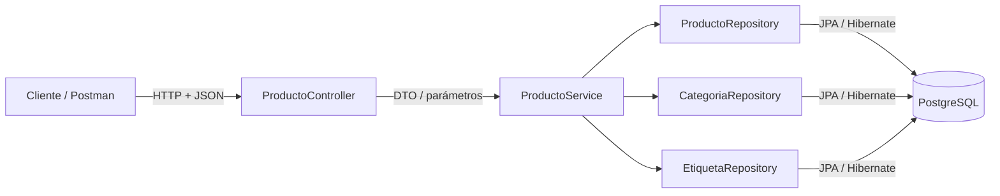
```mermaid
flowchart LR
    C[Cliente / Postman] -->|HTTP + JSON| CT[ProductoController]
    CT -->|DTO / parámetros| S[ProductoService]
    S --> R1[ProductoRepository]
    S --> R2[CategoriaRepository]
    S --> R3[EtiquetaRepository]
    R1 & R2 & R3 -->|JPA / Hibernate| DB[(PostgreSQL)]
```

## Estructura del proyecto (Paso 1)

El paquete base es `ni.edu.uam.gestion_productos`. Spring Initializr generó este nombre en la práctica anterior a partir del artefacto `gestion-productos`. El documento lo escribe como `ni.edu.uam.gestionproductos`, pero el paso 1 pide *crear o verificar* los paquetes, así que se mantuvo el nombre existente y se agregaron `dto` y `service`.

```
ni.edu.uam.gestion_productos
├── controller   → CategoriaController, ProductoController, ProveedorController, EtiquetaController
├── dto          → ProductoRequestDTO
├── entity       → Categoria, Producto, Proveedor, Etiqueta
├── repository   → CategoriaRepository, ProductoRepository, ProveedorRepository, EtiquetaRepository
└── service      → ProductoService, EtiquetaService
```

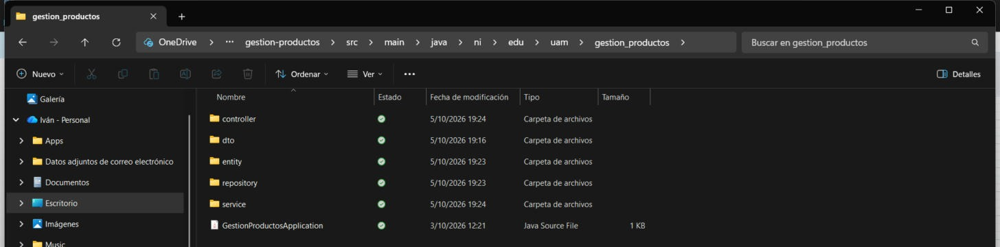

**Analice: ¿qué responsabilidad debería tener cada paquete?**
- `controller`: recibe las peticiones HTTP, lee parámetros y body, y devuelve la respuesta (código de estado + JSON). No contiene lógica de negocio.
- `dto`: define los objetos que la API recibe o devuelve, con solo los datos necesarios.
- `entity`: clases JPA mapeadas a las tablas de la base de datos.
- `repository`: acceso a datos mediante interfaces `JpaRepository` (consultas y persistencia).
- `service`: lógica de negocio. Valida, busca las entidades relacionadas, arma los objetos y coordina los repositorios.

## Pasos y commits

Cada paso se probó, se registró en su propio commit y se subió en ese momento:

| Paso | Commit | Descripción |
|---|---|---|
| 1 | `2654b0f` | Paquetes `dto` y `service` |
| 2 | `d752413` | `ProductoService` |
| 3 | `ddac8ce` | `ProductoController` usa `ProductoService` (GET y GET por id) |
| 4 | `8997f94` | `ProductoRequestDTO` |
| 5 | `ee72283` | POST de productos con el DTO (`categoriaId`) |
| 6 | `f695261` | PUT `/api/productos/{id}` |
| 7 | `5442b87` | DELETE `/api/productos/{id}` (204 No Content) |
| 8 | `7d8c9a8` | `@OneToMany(mappedBy = "categoria")` en `Categoria`, tal como indica el documento |
| 8 (corrección) | `b3ce320` | **Corrección del error del paso 8** (ver abajo) |
| 9 | `e6ee1cd` | GET `/api/productos/categoria/{categoriaId}` |
| 10 | `ea2d033` | Migración `V4__crear_etiquetas.sql` |
| 11 | `7a9ca19` | Entidad `Etiqueta` y `EtiquetaRepository` |
| 12 | `37ea284` | `@ManyToMany` Producto ↔ Etiqueta |
| 13 | `f12a418` + `a49b003` | POST `/api/etiquetas` (`EtiquetaService` y `EtiquetaController`). El segundo commit agrega el contenido de esos dos archivos, que quedaron vacíos en el primero por un corte de conexión al guardarlos. |
| 14 | `b8e74e2` | POST `/api/productos/{productoId}/etiquetas/{etiquetaId}` |
| 15 | `36b604b` | Reto final: quitar una etiqueta de un producto y consultar productos por etiqueta |

## Error detectado y corregido (Paso 8)

**Qué pasa con el código del documento.** El paso 8 agrega en `Categoria`:

```java
@OneToMany(mappedBy = "categoria")
private List<Producto> productos;
```

Con eso la relación queda **bidireccional**: `Producto → Categoria` y `Categoria → List<Producto>`. Los controladores siguen devolviendo entidades, así que Jackson, al convertir un producto a JSON, entra en un ciclo: producto → categoría → productos → categoría → productos…

**Cómo se detectó.** Al probar `GET /api/productos` justo después del paso 8, Postman mostró un `200 OK` con **12 KB de JSON anidado y cortado** (inválido), y la API registró:

```
WARN ... DefaultHandlerExceptionResolver : Ignoring exception, response committed already:
org.springframework.http.converter.HttpMessageNotWritableException: Could not write JSON:
Document nesting depth (501) exceeds the maximum allowed (500, from `StreamWriteConstraints.getMaxNestingDepth()`)
```

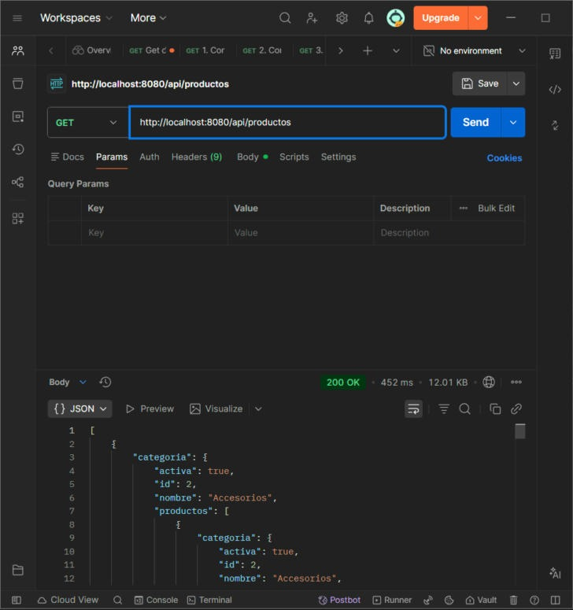

**Corrección (commit `b3ce320`).** Se marcó el lado inverso de la relación con `@JsonIgnore`. La relación sigue siendo bidireccional en JPA, pero la lista `productos` no se serializa:

```java
// Lado inverso de la relación Uno a Muchos: la clave foránea
// (categoria_id) está en la tabla producto.
// @JsonIgnore evita la recursión infinita al generar JSON
@OneToMany(mappedBy = "categoria")
@JsonIgnore
private List<Producto> productos;
```

Después de la corrección, `GET /api/productos` responde normalmente (898 B):

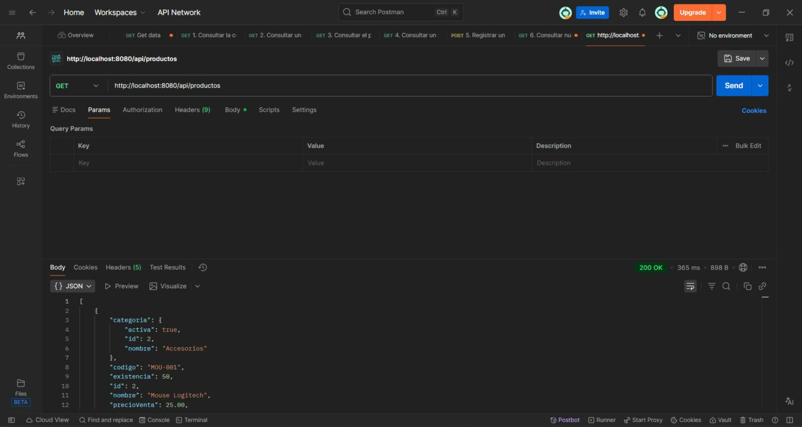

**Analice: ¿cuál entidad contiene realmente la clave foránea?** `Producto`. La columna `categoria_id` está en la tabla `producto` y se mapea con `@ManyToOne` + `@JoinColumn`; ese es el **lado propietario**. `Categoria` es el lado inverso (`mappedBy = "categoria"`) y no tiene ninguna columna para esa relación.

## Capa de servicio y DTO (Pasos 2 a 7)

**`ProductoRequestDTO`**: datos que la API recibe para crear o actualizar un producto:

```java
public class ProductoRequestDTO {
    private String codigo;
    private String nombre;
    private BigDecimal precioVenta;
    private Integer existencia;
    private Integer categoriaId;
    // Getters y Setters
}
```

**`ProductoService`**: lógica de negocio (código completo en [`ProductoService.java`](src/main/java/ni/edu/uam/gestion_productos/service/ProductoService.java)):

| Método | Qué hace |
|---|---|
| `listar()` | Todos los productos |
| `buscarPorId(id)` | Producto por id o `RuntimeException("Producto no encontrado")` |
| `guardar(ProductoRequestDTO)` | Busca la categoría por `categoriaId`, arma el `Producto` y lo guarda |
| `actualizar(id, dto)` | Busca el producto y la categoría, actualiza los campos y guarda |
| `eliminar(id)` | Elimina por id |
| `listarPorCategoria(categoriaId)` | `findByCategoriaId` |
| `agregarEtiqueta(productoId, etiquetaId)` | Agrega la etiqueta al `Set` del producto |
| `quitarEtiqueta(productoId, etiquetaId)` | Reto 1 |
| `listarPorEtiqueta(etiquetaId)` | Reto 2 |

**Analice: ¿por qué el Controller ya no debería utilizar directamente `ProductoRepository`?** Porque el controlador solo debe encargarse de HTTP (rutas, parámetros, códigos de respuesta). Si accede al repositorio, la lógica de negocio queda mezclada con la capa web: no se puede reutilizar desde otro lugar, es más difícil de probar y cualquier cambio en las reglas obliga a tocar los endpoints. El servicio concentra esa lógica y el controlador solo la invoca.

**Analice: ¿qué diferencia existe entre una entidad JPA y un DTO?** La entidad representa una tabla. Está anotada con `@Entity`, Hibernate la administra y contiene relaciones con otras entidades. El DTO es una clase simple, sin anotaciones JPA, que define solo los datos que viajan por la API. Así no se expone la estructura interna de la base de datos y se controla qué puede enviar el cliente.

**Analice: ¿qué ventaja ofrece enviar `categoriaId` en lugar de un objeto `Categoria` completo?** El cliente solo indica a qué categoría pertenece el producto. Es más simple y no puede modificar ni inventar datos de la categoría. El servicio comprueba que exista (si no, responde "Categoria no encontrada") y usa la categoría real de la base de datos. Por eso, en la respuesta del POST, la categoría ya aparece completa.

## CRUD completo de productos

| Método | Endpoint | Operación | Resultado en las pruebas |
|---|---|---|---|
| GET | `/api/productos` | Listar | 200 OK |
| GET | `/api/productos/{id}` | Buscar | 200 OK |
| POST | `/api/productos` | Crear (con `ProductoRequestDTO`) | 200 OK, `TEC-001` creado con id 4 |
| PUT | `/api/productos/{id}` | Actualizar | 200 OK, `LAP-001` actualizado |
| DELETE | `/api/productos/{id}` | Eliminar | **204 No Content** |
| GET | `/api/productos/categoria/{categoriaId}` | Productos por categoría | 200 OK |
| POST | `/api/etiquetas` | Crear etiqueta | 200 OK |
| GET | `/api/etiquetas` | Listar etiquetas | 200 OK |
| POST | `/api/productos/{productoId}/etiquetas/{etiquetaId}` | Asociar etiqueta | 200 OK |
| DELETE | `/api/productos/{productoId}/etiquetas/{etiquetaId}` | Reto 1: quitar asociación | **204 No Content** |
| GET | `/api/productos/etiqueta/{etiquetaId}` | Reto 2: productos por etiqueta | 200 OK |

**GET `/api/productos`** (paso 3):

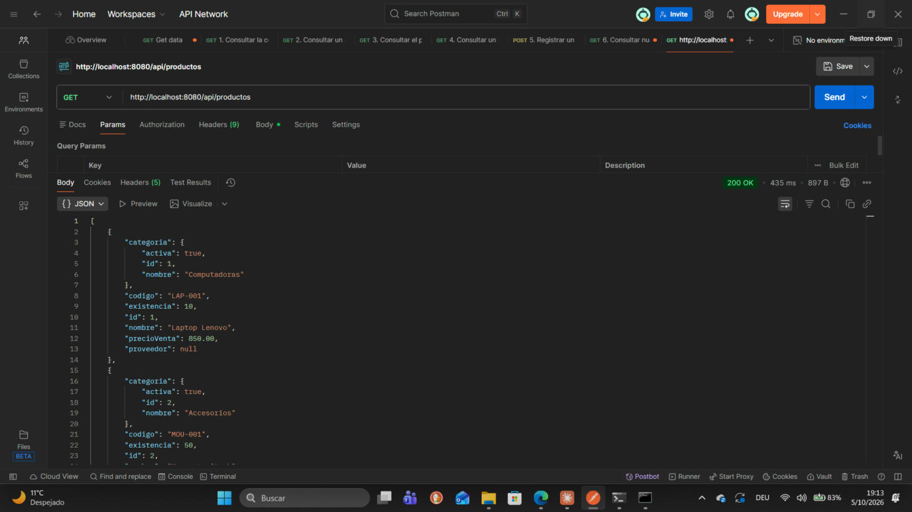

**GET `/api/productos/1`** (paso 3):

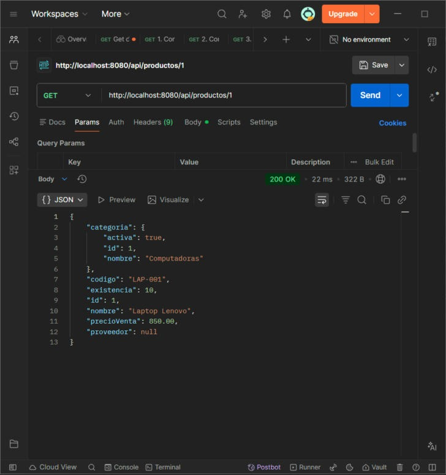

**POST `/api/productos`** con el DTO (paso 5):

```json
{
    "codigo": "TEC-001",
    "nombre": "Teclado mecánico",
    "precioVenta": 75.50,
    "existencia": 20,
    "categoriaId": 2
}
```

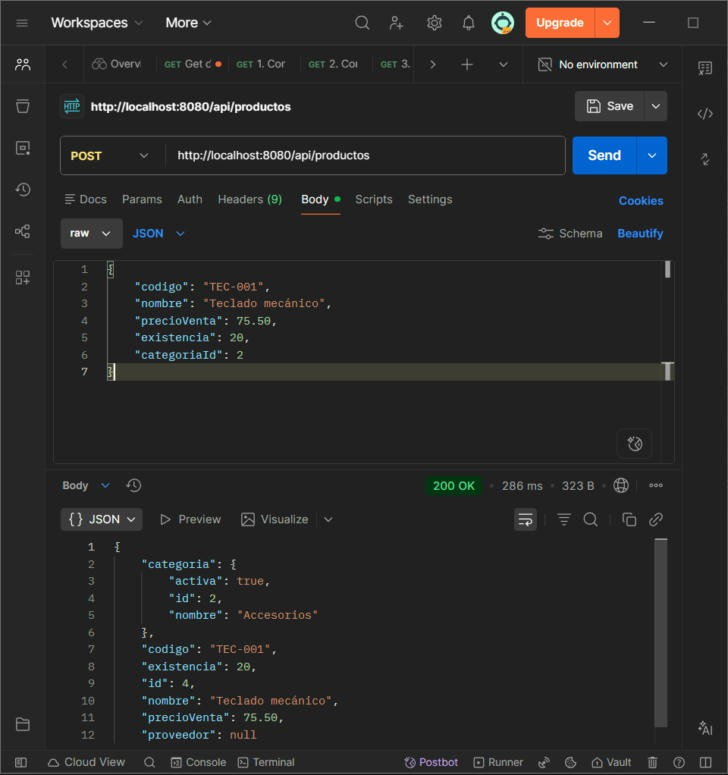

**PUT `/api/productos/1`** (paso 6):

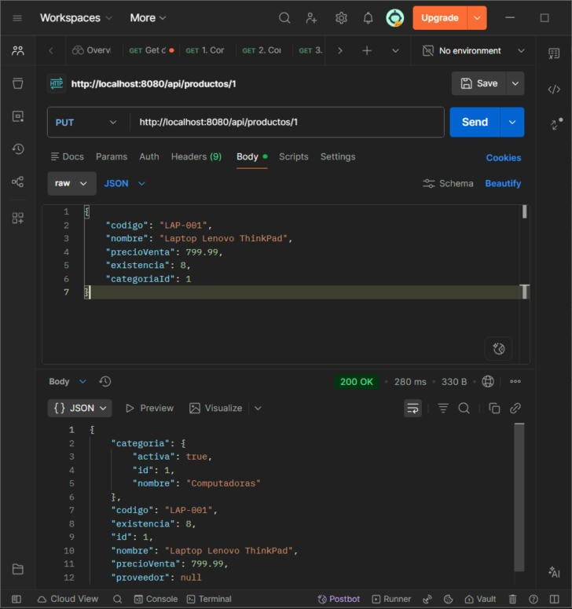

**DELETE `/api/productos/1`** → 204 No Content (paso 7):

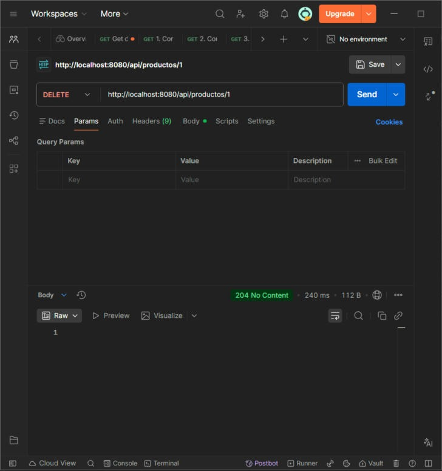

**GET `/api/productos/categoria/2`** (paso 9). Se usó la categoría 2 porque el producto de la categoría 1 (`LAP-001`) se eliminó en el paso 7:

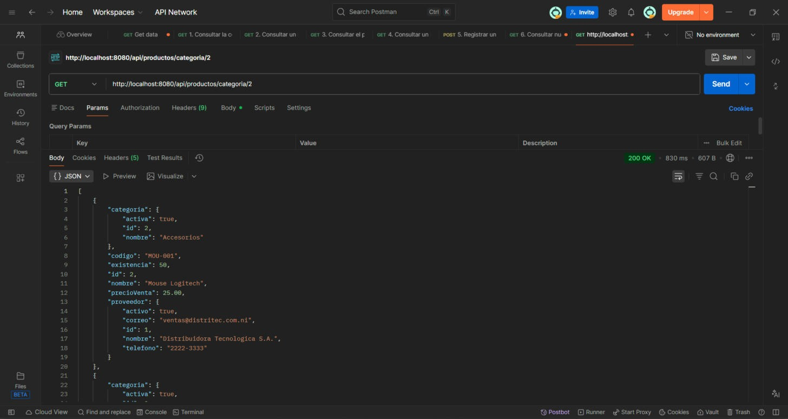

## Relación Muchos a Muchos: Producto N ── N Etiqueta (Pasos 10 a 14)

### V4__crear_etiquetas.sql

```sql
CREATE TABLE etiqueta (
    id SERIAL PRIMARY KEY,
    nombre VARCHAR(100) NOT NULL UNIQUE
);

CREATE TABLE producto_etiqueta (
    producto_id INTEGER NOT NULL,
    etiqueta_id INTEGER NOT NULL,

    PRIMARY KEY (producto_id, etiqueta_id),

    CONSTRAINT fk_producto_etiqueta_producto
        FOREIGN KEY (producto_id)
        REFERENCES producto(id),

    CONSTRAINT fk_producto_etiqueta_etiqueta
        FOREIGN KEY (etiqueta_id)
        REFERENCES etiqueta(id)
);
```

**Analice: ¿por qué una relación Muchos a Muchos requiere una tabla intermedia?** En una base relacional cada columna guarda un solo valor. Un producto puede tener varias etiquetas y una etiqueta varios productos, así que ninguna de las dos tablas puede guardar "la lista" de la otra. La tabla intermedia `producto_etiqueta` guarda una fila por cada par (producto, etiqueta), con una clave foránea a cada tabla y una clave primaria compuesta que evita repetir el mismo par.

### Entidad, repositorio y relación

```java
@Entity
@Table(name = "etiqueta")
public class Etiqueta {
    @Id
    @GeneratedValue(strategy = GenerationType.IDENTITY)
    private Integer id;
    private String nombre;
    // Getters y Setters
}

public interface EtiquetaRepository extends JpaRepository<Etiqueta, Integer> { }
```

En `Producto`:

```java
@ManyToMany
@JoinTable(
    name = "producto_etiqueta",
    joinColumns = @JoinColumn(name = "producto_id"),
    inverseJoinColumns = @JoinColumn(name = "etiqueta_id")
)
private Set<Etiqueta> etiquetas = new HashSet<>();
```

**Diagrama de relaciones actualizado** (ERD generado por pgAdmin):

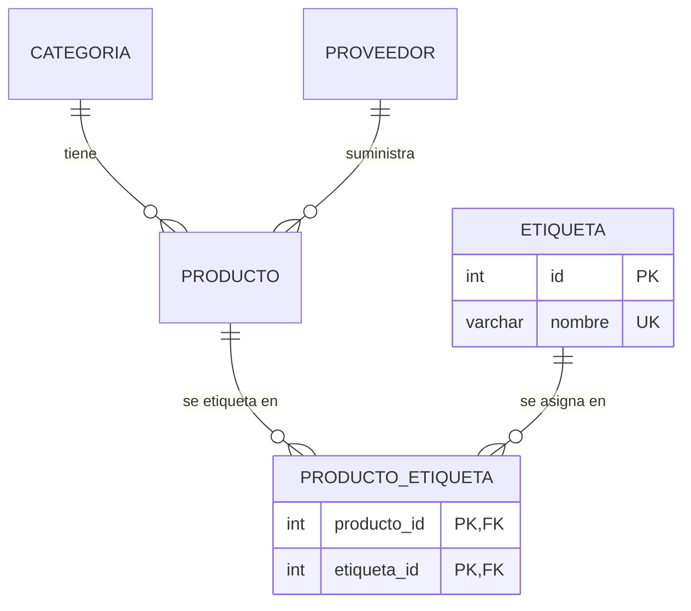
```mermaid
erDiagram
    CATEGORIA ||--o{ PRODUCTO : "tiene"
    PROVEEDOR ||--o{ PRODUCTO : "suministra"
    PRODUCTO ||--o{ PRODUCTO_ETIQUETA : "se etiqueta en"
    ETIQUETA ||--o{ PRODUCTO_ETIQUETA : "se asigna en"

    PRODUCTO_ETIQUETA {
        int producto_id PK,FK
        int etiqueta_id PK,FK
    }
    ETIQUETA {
        int id PK
        varchar nombre UK
    }
```

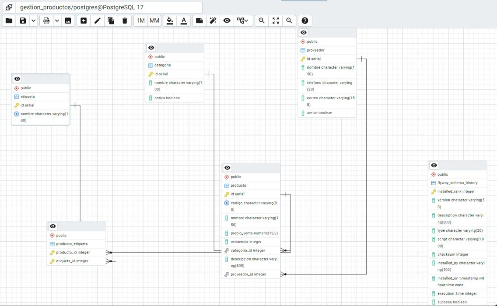

**Historial de Flyway con V4:**

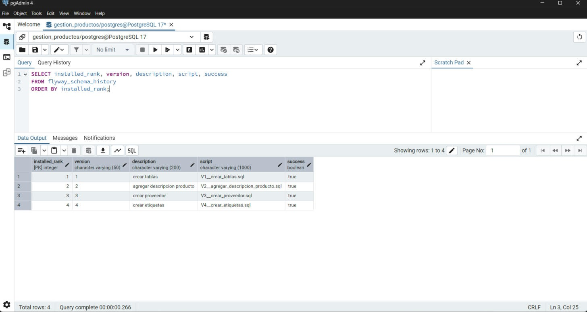

### Etiquetas creadas (paso 13)

Se crearon **Oferta, Importado, Empresarial, Portátil y Gaming** con `POST /api/etiquetas`:

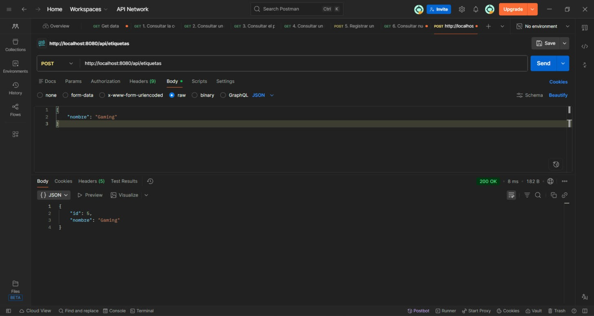

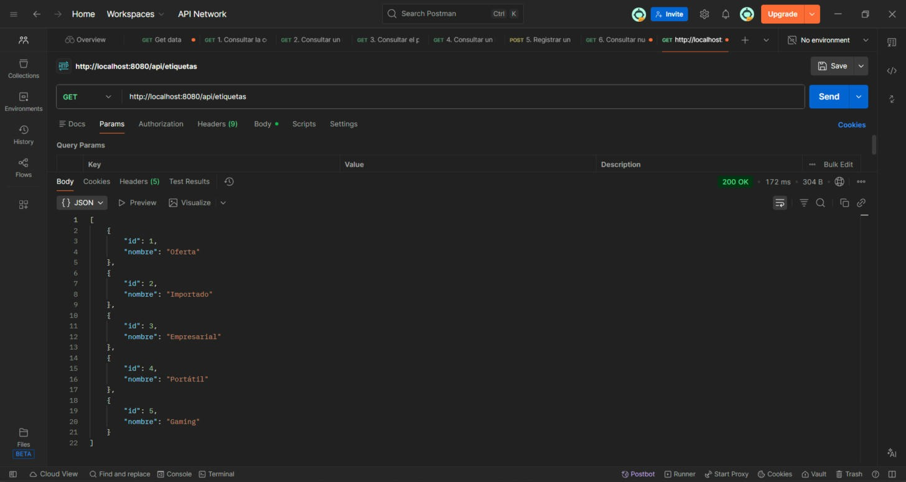

### Asociación de etiquetas (paso 14)

Asociaciones realizadas con `POST /api/productos/{productoId}/etiquetas/{etiquetaId}`:

| Producto | Etiquetas |
|---|---|
| 2 · MOU-001 Mouse Logitech | Oferta, Importado |
| 3 · MON-001 Monitor Samsung 24 pulgadas | Importado, Empresarial |
| 4 · TEC-001 Teclado mecánico | Oferta, Gaming |

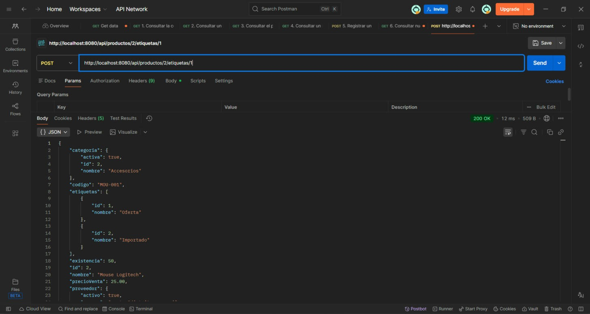

**Tabla `producto_etiqueta` en PostgreSQL** (después del reto 1, que quitó "Oferta" del producto 2):

```sql
SELECT pe.producto_id, p.codigo, p.nombre AS producto,
       pe.etiqueta_id, e.nombre AS etiqueta
FROM producto_etiqueta pe
JOIN producto p ON p.id = pe.producto_id
JOIN etiqueta e ON e.id = pe.etiqueta_id
ORDER BY pe.producto_id, pe.etiqueta_id;
```

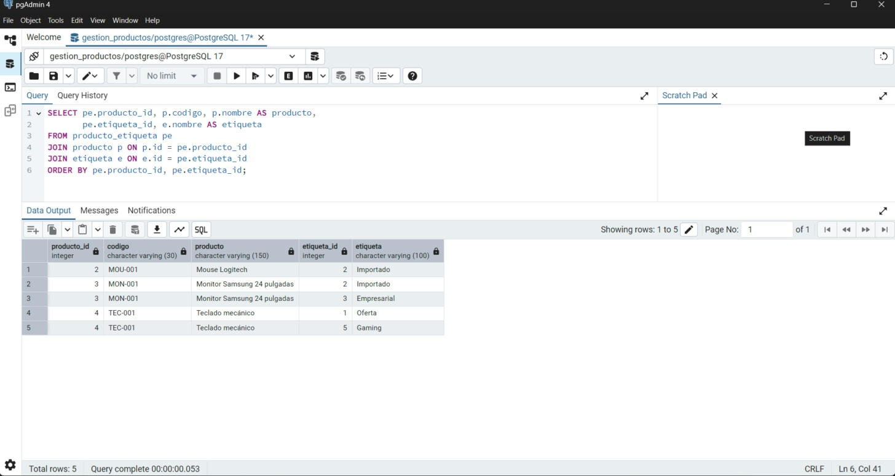

## Paso 15: Reto final (solución)

### Reto 1: eliminar la asociación Producto–Etiqueta

`DELETE /api/productos/{productoId}/etiquetas/{etiquetaId}` elimina **solo la fila de `producto_etiqueta`**. El producto y la etiqueta siguen existiendo.

```java
// ProductoService
public void quitarEtiqueta(Integer productoId, Integer etiquetaId) {
    Producto producto = buscarPorId(productoId);

    if (!etiquetaRepository.existsById(etiquetaId)) {
        throw new RuntimeException("Etiqueta no encontrada");
    }

    producto.getEtiquetas()
            .removeIf(etiqueta -> etiqueta.getId().equals(etiquetaId));

    productoRepository.save(producto);
}

// ProductoController
@DeleteMapping("/{productoId}/etiquetas/{etiquetaId}")
public ResponseEntity<Void> quitarEtiqueta(@PathVariable Integer productoId,
                                           @PathVariable Integer etiquetaId) {
    productoService.quitarEtiqueta(productoId, etiquetaId);
    return ResponseEntity.noContent().build();
}
```

Como `Producto` es el lado propietario de `@ManyToMany`, al quitar la etiqueta del `Set` y guardar, Hibernate ejecuta un `DELETE` solo sobre `producto_etiqueta`.

`DELETE /api/productos/2/etiquetas/1` → **204 No Content**:

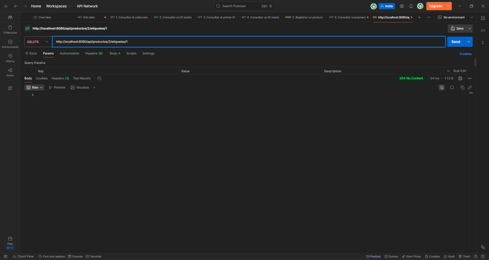

El producto 2 sigue existiendo, ahora solo con la etiqueta "Importado". La etiqueta "Oferta" también sigue existiendo y se mantiene asociada al producto 4:

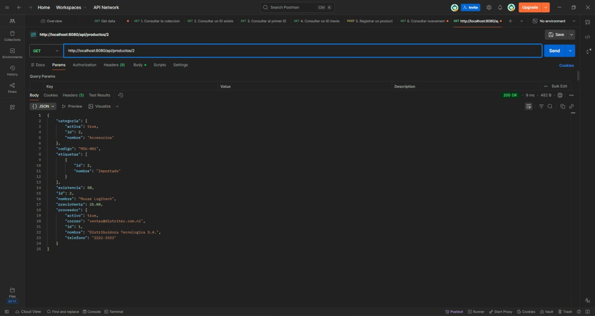

### Reto 2: consultar productos por etiqueta

`GET /api/productos/etiqueta/{etiquetaId}` usa una consulta derivada que navega la relación Muchos a Muchos:

```java
// ProductoRepository
List<Producto> findByEtiquetasId(Integer etiquetaId);

// ProductoService
public List<Producto> listarPorEtiqueta(Integer etiquetaId) {
    if (!etiquetaRepository.existsById(etiquetaId)) {
        throw new RuntimeException("Etiqueta no encontrada");
    }
    return productoRepository.findByEtiquetasId(etiquetaId);
}

// ProductoController
@GetMapping("/etiqueta/{etiquetaId}")
public List<Producto> listarPorEtiqueta(@PathVariable Integer etiquetaId) {
    return productoService.listarPorEtiqueta(etiquetaId);
}
```

`GET /api/productos/etiqueta/1` ("Oferta") devolvió los productos 2 (MOU-001) y 4 (TEC-001). Esto fue antes del reto 1:

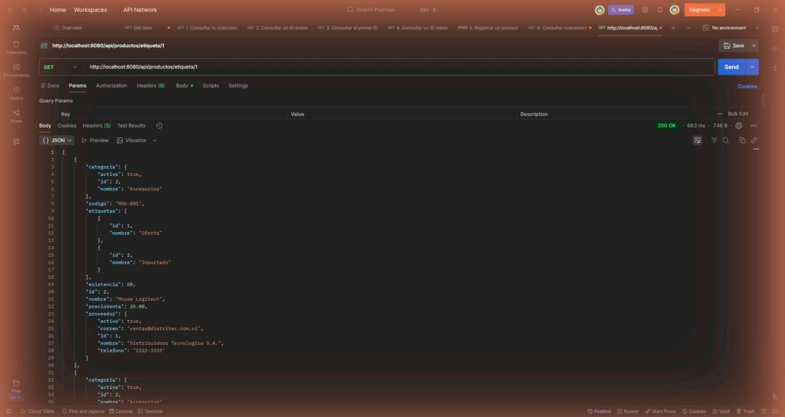

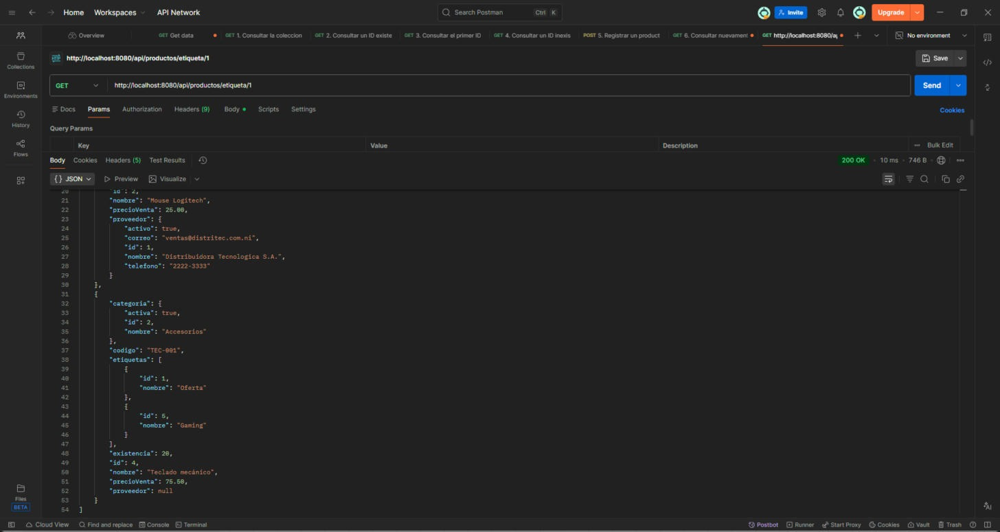

## Comprobación de aprendizaje (Laboratorio #1)

**1. ¿Cuál es la función de una clase Service?**
Contener la lógica de negocio. Recibe lo que el controlador le pasa (parámetros o DTOs), aplica las reglas (validar que la categoría o la etiqueta existan, armar la entidad, asociar objetos), coordina uno o varios repositorios y devuelve el resultado. Se marca con `@Service` para que Spring la cree y la inyecte.

**2. ¿Por qué un controlador no debería contener toda la lógica de negocio?**
Porque mezcla responsabilidades. El controlador debe ocuparse solo de HTTP: rutas, parámetros, cuerpo y códigos de respuesta. Si además tiene la lógica, esta no se puede reutilizar desde otros controladores o procesos, es más difícil de probar sin levantar la capa web y cualquier cambio en las reglas obliga a modificar los endpoints. Separarla en servicios hace el código más ordenado y mantenible.

**3. ¿Qué es un DTO?**
Un *Data Transfer Object*: una clase simple, solo con atributos, getters y setters, que define los datos que viajan entre el cliente y la API. Por ejemplo, `ProductoRequestDTO` contiene solo lo necesario para registrar o actualizar un producto.

**4. ¿Qué diferencia existe entre un DTO y una entidad JPA?**
La entidad (`@Entity`) representa una tabla. Hibernate la administra, tiene identidad (`@Id`) y relaciones con otras entidades, y sus cambios se guardan en la base de datos. El DTO no está ligado a la base de datos, no tiene anotaciones JPA y solo transporta datos. Así se controla qué recibe y qué expone la API, sin revelar la estructura interna ni permitir que el cliente modifique campos que no debe.

**5. ¿Qué ventaja tiene recibir `categoriaId` en lugar de una entidad `Categoria` completa?**
El JSON es más simple y el cliente solo indica la referencia. No puede enviar ni alterar datos de la categoría, como su nombre o su estado. El servicio busca la categoría real en la base de datos, valida que exista y la asigna. Además, el contrato de la API no depende de la estructura de la entidad.

**6. ¿Qué relación representan `@OneToMany` y `@ManyToOne`?**
Son los dos lados de una relación **Uno a Muchos**. `@ManyToOne` (en `Producto`) indica que muchos productos pertenecen a una categoría; es el lado propietario y tiene la clave foránea. `@OneToMany(mappedBy = "categoria")` (en `Categoria`) indica que una categoría tiene muchos productos; es el lado inverso. Usar las dos hace la relación **bidireccional**.

**7. ¿Dónde se almacena la clave foránea en la relación Categoria–Producto?**
En la tabla **`producto`**, en la columna `categoria_id`, que referencia a `categoria(id)`. En el código la mapea `@JoinColumn(name = "categoria_id")` en la entidad `Producto`. La tabla `categoria` no tiene ninguna columna para esta relación.

**8. ¿Qué representa `@ManyToMany`?**
Una relación **Muchos a Muchos**: un producto puede tener muchas etiquetas y una etiqueta puede estar en muchos productos. En la base de datos se implementa con una tabla intermedia (`producto_etiqueta`).

**9. ¿Cuál es la función de `@JoinTable`?**
Define la tabla intermedia de una relación `@ManyToMany`: su nombre (`producto_etiqueta`), la columna que apunta a la entidad propietaria (`joinColumns = producto_id`) y la que apunta a la otra entidad (`inverseJoinColumns = etiqueta_id`). Con eso Hibernate sabe dónde insertar y borrar las asociaciones.

**10. ¿Por qué se necesita la tabla `producto_etiqueta`?**
Porque una relación Muchos a Muchos no se puede representar con una sola clave foránea: ni `producto` ni `etiqueta` pueden guardar una lista de ids en una columna. La tabla intermedia guarda una fila por cada asociación (producto_id, etiqueta_id). Sus claves foráneas aseguran que ambos existan y su clave primaria compuesta evita duplicar el mismo par.

**11. ¿Qué responsabilidad corresponde al Repository?**
El acceso a datos. Al extender `JpaRepository`, ofrece las operaciones básicas (`findAll`, `findById`, `save`, `deleteById`, `existsById`, `count`) y permite declarar consultas derivadas por nombre, como `findByCategoriaId` y `findByEtiquetasId`, sin escribir SQL. No debe contener lógica de negocio.

**12. Explique el flujo: Cliente → Controller → Service → Repository → PostgreSQL.**
Ejemplo con `POST /api/productos`:
1. **Cliente**: Postman envía la petición HTTP con el JSON del producto (`codigo`, `nombre`, `precioVenta`, `existencia`, `categoriaId`).
2. **Controller**: `ProductoController` recibe la petición. Spring convierte el JSON en un `ProductoRequestDTO` (`@RequestBody`) y el controlador llama a `productoService.guardar(dto)`.
3. **Service**: `ProductoService` busca la categoría con `CategoriaRepository` (si no existe, lanza el error), crea la entidad `Producto` con los datos del DTO y la categoría, y pide guardarla.
4. **Repository**: `ProductoRepository.save()` delega en JPA/Hibernate, que genera el SQL (`INSERT INTO producto ...`).
5. **PostgreSQL**: ejecuta la sentencia y genera el `id`.

La respuesta hace el camino inverso: el repositorio devuelve la entidad guardada, el servicio la retorna, el controlador la entrega y Spring la convierte a JSON con código 200 para el cliente.

## Conclusión (Laboratorio #1)

En este laboratorio la API pasó de controladores que usaban directamente los repositorios a una arquitectura en capas **Controller → Service → Repository**, con la lógica de negocio concentrada en `ProductoService`. El uso de `ProductoRequestDTO` permitió controlar los datos recibidos y validar la categoría por su id, y se completó el CRUD de productos (GET, POST, PUT y DELETE) junto con la consulta por categoría. Al volver bidireccional la relación Categoría–Producto apareció el error de recursión infinita al generar JSON; se detectó al probar el endpoint y se corrigió con `@JsonIgnore` en el lado inverso. La migración V4 incorporó la relación Muchos a Muchos con `Etiqueta` mediante la tabla intermedia `producto_etiqueta` y `@ManyToMany` con `@JoinTable`. Finalmente, el reto mostró cómo eliminar solo una asociación y cómo consultar productos navegando una relación N:N con una consulta derivada.
